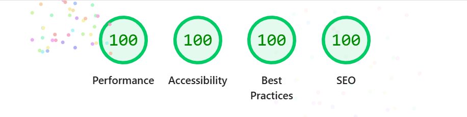

Assignment 3 - Persistence: Two-tier Web Application with Database, Express server, and CSS template
===

## Job Application Tracker 

Link: https://a3-sahana-gokulakrishnan.onrender.com/ 

This app helps users to add and manage their job applications. They can also delete the application, update the status of the application. Records stored in MongoDB. 

One of the main challenge I faced was with the conversion from original node HTTP server to Express while I still had the add, update, and delete functionalities. Another challenge was when I had to connect sessions to the database queries so that records were filtered, updated, and deleted according to the user that is logged in. 

In terms of authentication strategy, I chose username-based with express-session. When a username doesn't exist, then the app. automatically creates an account and informs the user. I did this so that it provides a simple login process while still allowing the server to have a username/login session. 

For CSS framework, I used Bootstrap since it provided responsive forms, cards, buttons, tables, and spacing functionalities without requiring custom CSS. For the custom styling, I added the Georgia font, dark text and light background, maximum width for login, section spacing, and keyboard focus utilities. 

## Technical Achievements
- **Tech Achievement 1**: 
1. I used Helmet middleware to add security-related HTTP response headers to the app. 
2. Compression middleware used to reduce the size of the HTTP responses. 
3. Morgan middleware used to log all the HTTP request methods, paths, statuses, and response times for easier debugging. 
4. Another middleware called response-time to measure request time it took to process and include it in the X-Response-Time response header. 
5. Finally, express-session used to maintain login session, where it creates a session cookie that lets the server recognize the user across requests. 

- **100 on all lighthouse tests:** 
### Design/Evaluation Achievements
- **Design Achievement 1**: I followed the following tips from the W3C Web Accessibility Initiative

1. **Provide informative, unique page titles:** I changed the page title from Assignment 3 to "Job Application Tracker" so that browser tabs and screen reads a clear title that describes the actual purpose of the page. 

2. **Use mark-up to convey meaning and structure:** I added descriptive caption to the results table and added scope='col' to every column heading. This is to ensure that screen readers can understand the purpose and structure of the application data. 

3. **Help users avoid and correct mistakes:** I added instructions explaining about most of the application fields being required, included "required" in each label, and used the HTML  required attribute so browsers and assistive technologies can identify incomplete fields. 

4. **Input assistance support:** Added autocomplete='username' to the login field so browsers and any assistive technology can easily identify the field's purpose and help users enter saved info. 

5. **Design for different viewport sizes:** Added the meta tag for viewport and used Bootstrap's responsive container and table classes so that the interface can adapt according to different screens and browser without clipping the form. 

6. **Ensure that interactive elements are easy to identify:** Added ARIA labels to every update and delete button. Screen readers can identify which company's application each repeated action button affects. 

7. **Associate a label with every form control:** Every dynamically generated status dropdown now has a descriptive ARIA label that includes the application's company name. This is to ensure that the screen-reader can understand which record the control changes. 

8. **Keyboard focus visible:**  Added a focus outline w/ spacing around links, buttons, inputs, and selects. Keyboard users now can clearly be able to tell which control will receive their next action. 

9. **Headings and spacing to group related content:**  Used Bootstrap cards, padding, margins, and section headings to visually separate login, app. entry, and the results. This follows the rule of using headings and spacing to group related content. 

10. **Provide identifiable feedback:** Added an ARIA live status to announce when an application is added/deleted/updated instead of just using alert for update. Follows recommendation of how to provide clear, identifiable feedback after user actions. 

11. **Clear and simple language:** Rewrote the login instructions to explain directly that users can enter a username and that an account will be created automatically if it doesn't exist already. Then, connected these instructions to the username field using aria-describedby

12. **Color Contrast:** Used dark text on white/light backgrounds to create a good contrast. I also used Bootstrap button variants that provide contrasting text, background, and borders. 

